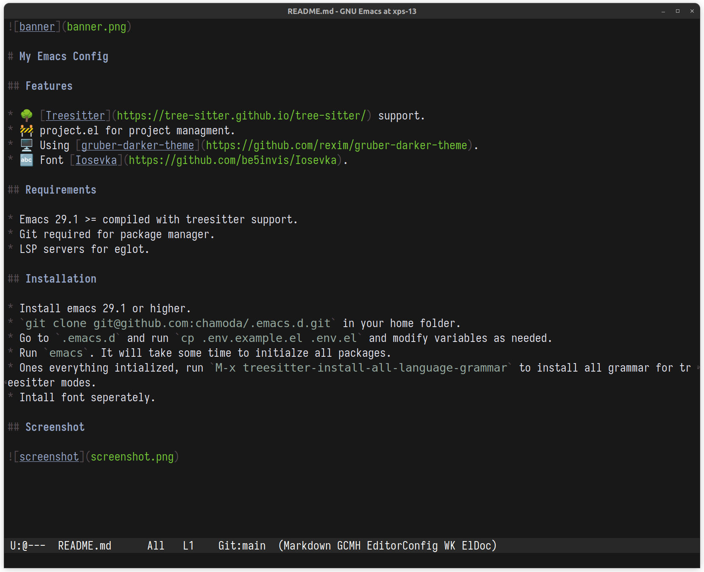

# My Emacs Config

## Features

* 🧘 Vanila Emacs with minimial third party packages.
* 🌳 [Treesitter](https://tree-sitter.github.io/tree-sitter/) support.
* ⌨️ Using classic keybindings.
* 🚧 project.el for project managment.

## Requirements

* Emacs 29.1 >= compiled with treesitter support.
* Git is required for package manager.
* LSP servers for eglot.

## Installation

* Install emacs 29.1 or higher. `sudo snap install emacs --classic` works. 
* `git clone git@github.com:chamoda/.emacs.d.git` in your home folder.
* Go to `.emacs.d` and run `cp .env.example.el .env.el` and modify variables as needed.
* Run `emacs`. It will take some time to initialze all packages.
* Ones everything intialized, run `M-x treesitter-install-all-language-grammar` to install all grammar for treesitter modes.

## Screenshot

